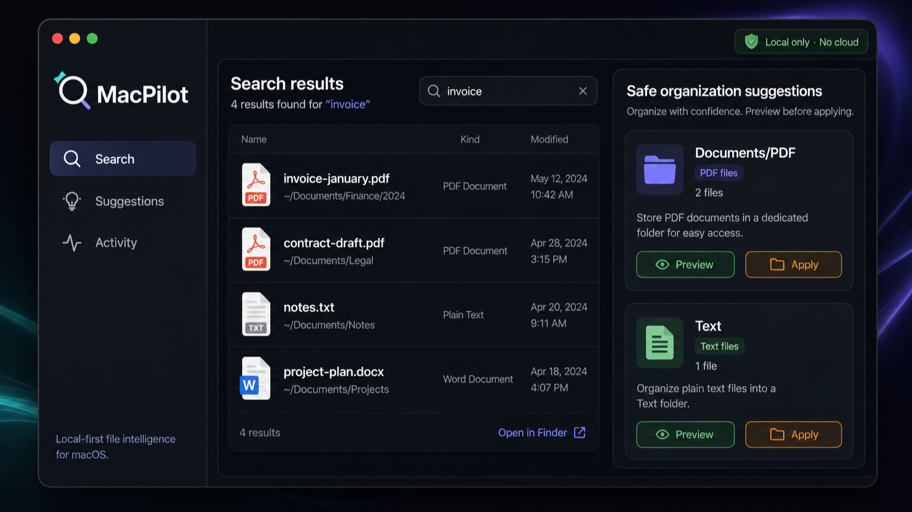

# MacPilot

<p align="center">
  
</p>

<p align="center">
  <strong>Local-first file intelligence for macOS.</strong><br />
  Search faster. Organize safely. Keep control of your files.
</p>

<p align="center">
  <a href="https://github.com/jamesdong95/MacPilot/actions/workflows/python.yml"></a>
  <a href="https://github.com/jamesdong95/MacPilot/actions/workflows/macos-demo.yml"></a>
  
  
  
  
</p>

MacPilot is a dependency-light file search and safe-organization MVP for macOS. It builds a local SQLite index with FTS5, turns search results into deterministic organization suggestions, and keeps every filesystem mutation behind an explicit preview-and-apply flow.

> **The short version:** MacPilot helps you understand and organize your files without uploading them to a cloud service or silently changing your filesystem.

## Why MacPilot?

Most file automation tools optimize for speed first. MacPilot optimizes for **control** first:

- **Local by default** — indexing and search stay in a local SQLite database.
- **Read-only by default** — discovery and suggestions do not modify files.
- **Preview before apply** — `move` and `undo` require an explicit `--apply` flag.
- **No silent overwrite** — existing destinations and race-condition collisions are rejected.
- **No symlink traversal** — unsafe source and destination paths are refused.
- **Undoable actions** — applied moves are recorded in an action log.
- **Dependency-light core** — the runtime uses Python's standard library and SQLite FTS5.

## What you can try today

### Python core and CLI

- Index filenames and text content into SQLite FTS5.
- Search indexed files with predictable local results.
- Generate deterministic organization suggestions.
- Preview, apply, inspect, and undo file moves.
- Inspect current index and action-log state with `status` and `actions`.

### Native SwiftUI client

The repository also contains a macOS SwiftUI client connected to the local Python core:

- Choose a local folder and index it into SQLite.
- Search real filenames, paths, and indexed text content.
- Inspect real file metadata and snippets.
- Review deterministic organization suggestions.
- Preview every move before anything changes on disk.
- Apply moves with an explicit confirmation dialog; each move is recorded
  in the local action log and can be undone from Activity.
- Undo a recorded move from Activity with confirmation; the file is restored
  to its original location.
- Responsive window: opens compact and centered (960x640), clamps to the
  visible screen on resize, and every pane (sidebar, results, inspector,
  filter row) adapts down to the minimum size without clipping.
- Keep all core calls local with no upload or network dependency.

Every filesystem mutation is preview-first and confirm-first: the client never
passes `--apply` without an explicit confirmation, never deletes files, and the
Python core coordinates filesystem and SQLite updates with rollback handling.
To let the client find the Python core during development, set
`MACPILOT_PROJECT_ROOT` in the Xcode scheme, install the `macpilot` command on
`PATH`, or set `MACPILOT_CLI` to an executable path. `MACPILOT_DB` can point to
an isolated SQLite database for testing.

## Quick start

### Run the Python core from source

From the repository root:

```bash
python3 -m unittest discover -s tests -v
python3 -m compileall -q macpilot
```

Use an isolated database while experimenting:

```bash
DB=/tmp/macpilot.sqlite3

python3 -m macpilot --db "$DB" index ~/Downloads
python3 -m macpilot --db "$DB" search "project contract"
python3 -m macpilot --db "$DB" suggest ~/Downloads
python3 -m macpilot --db "$DB" status
```

If the package is installed, use `macpilot` instead of `python3 -m macpilot`.

### Install or build the Python package

Using `uv`:

```bash
uv venv
uv pip install -e .
uv build --wheel
```

Using the standard library virtual-environment workflow:

```bash
python3 -m venv .venv
. .venv/bin/activate
python -m pip install -e .
```

### Run the safe move flow

Every mutating command is preview-only until `--apply` is supplied:

```bash
# Preview: the source file is not changed.
python3 -m macpilot --db "$DB" move \
  ~/Downloads/report.pdf ~/Documents/Reports/report.pdf

# Apply only after reviewing the JSON preview.
python3 -m macpilot --db "$DB" move \
  ~/Downloads/report.pdf ~/Documents/Reports/report.pdf --apply

# Inspect the action log.
python3 -m macpilot --db "$DB" actions --active-only

# Preview and then apply an undo.
python3 -m macpilot --db "$DB" undo 1
python3 -m macpilot --db "$DB" undo 1 --apply
```

Applied moves require the source to be indexed first. MacPilot refuses symlink paths, refuses to overwrite existing destinations, coordinates filesystem and SQLite updates, and attempts to restore the original path if recording the action fails. There is no delete command.

## Open the native client

Requirements: macOS and Xcode 15 or newer.

Open `MacPilotDemo/MacPilotDemo.xcodeproj` in Xcode, select the shared `MacPilotDemo` scheme, choose **My Mac**, and press **Run**.

For a source checkout, add these Xcode scheme environment variables before running:

```text
MACPILOT_PROJECT_ROOT=/absolute/path/to/MacPilot
MACPILOT_DB=/tmp/macpilot-demo.sqlite3
```

Or build without code signing from the repository root:

```bash
xcodebuild \
  -project MacPilotDemo/MacPilotDemo.xcodeproj \
  -scheme MacPilotDemo \
  -configuration Debug \
  -sdk macosx \
  -derivedDataPath /tmp/MacPilotDerivedData \
  CODE_SIGNING_ALLOWED=NO build

open /tmp/MacPilotDerivedData/Build/Products/Debug/MacPilotDemo.app
```

The client asks you to choose a folder before indexing. Indexing, search, suggestions, move previews, confirmed applies, and confirmed undos use the real local filesystem and SQLite index. Applied moves are recorded in the action log and can be undone from Activity.

## Safety model

| Principle | Behavior |
| --- | --- |
| Local-first | No upload, telemetry, or network/API dependency in the Python core. |
| Preview-first | Filesystem mutations return a preview until `--apply` is explicit. |
| No symlink traversal | Symlink sources and destinations, including broken links, are rejected. |
| No overwrite | Destination collisions are rejected, including a destination that appears during a move. |
| Transactional recording | Filesystem and SQLite/action-log updates are coordinated with rollback handling. |
| Undoable changes | Applied moves are recorded and can be inspected before undoing. |

## Project layout

```text
macpilot/                 Python core and CLI
tests/                    Standard-library unittest suite
MacPilotDemo/             Native SwiftUI client (preview, apply, undo)
docs/assets/              GitHub README artwork
.github/workflows/        Python and macOS CI
```

## Current scope

MacPilot is an MVP for local testing and product exploration, not a finished background file-management agent. The following are intentionally out of scope for this milestone:

- Semantic embeddings or automatic semantic classification.
- Ollama integration.
- Background file automation.
- Signed and notarized distribution.

Contributions that preserve the local-first, preview-first safety model are welcome. See [`CONTRIBUTING.md`](CONTRIBUTING.md) for the verification checklist and project expectations.

## Changelog

See [`CHANGELOG.md`](CHANGELOG.md) for the version history.
